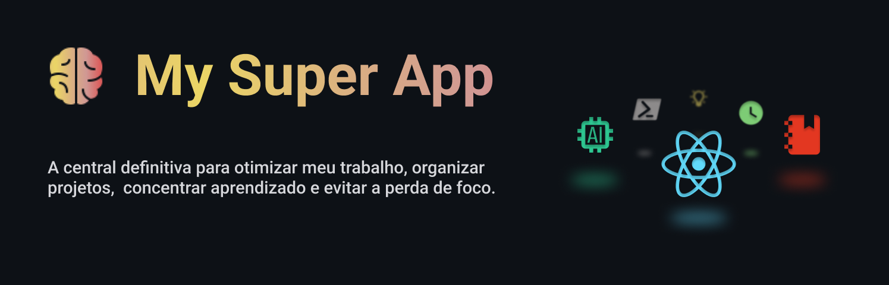

# Filosofia

é um aplicativo móvel que oferece uma variedade de serviços "essenciais" na vida do usuário em um só lugar. O intuito do `msa` é se tornar um pilar no meu/seu dia-a-dia, trabalhando como um segundo cérebro e até um clone para rotinas demoradas e tediosas.

Enquanto o sistema de front-end da ferramenta é totalmente open-source, o sistema de back-end não é. No entanto, nada lhe impede de utilizar o estado atual da aplicação e construir seu próprio produto.

 

## 📚 Objetivo

Reunir todas as ferramentas necessárias para melhorar minha produtividade em um único lugar, garantindo que meu tempo seja usado da forma mais eficiente possível.

 

## 🛠 Funcionalidades

**Central de Projetos**

É tratado como um projeto é qualquer ideia que tenha um início-meio-fim. Desde um livro que você queira finalizar até um projeto inteiro de software.

... e sim! O próprio My Super App está dentro do My Super App ... o meu no caso 😊.

 

**Central de Guias**

Agora que você já possui um projeto, talvez seja a hora de anotar e aplicar esse conhecimento de forma prática. Crie um guia, evite retrabalho e otimize o processo de aprendizado próprio e da sua equipe.

 

**Biblioteca de Componentes**

Esse é só para os devs ... por enquanto!

Ao invés de reescrever seus componentes toda vez que precisa tenha eles prontos para serem copiados e colados.

 

**Geração de Interfaces com LLM**

Talvez a funcionalidade não parecia tão interessante tendo em vista a existe de snippets, mas imagine que agora que você possui seus componentes catalogados dentro do My Super App, você pode adicionar estes componentes como contexto para LLMs.

Gerar um wireframe para um POC será muito mais rapido e padronizado com o seus componentes de sua aplicação, sem mais uma sopinha colorida de componentes. Escolha os componentes, escolha o que criar e tchum!

 

**Feed de Conteúdo Relevante**

Tudo bem, muita produtividade, mas e quando eu posso descansar? É pra já! Porém, kembre-se estar parada é diferente de estar descansar. Um novo foco, deve ser o suficiente para relaxar o cérebro, mas será que as redes sociais vão deixar isso?

Evite distrações ao não precisar visitar páginas iniciais nas suas contas em redes sociais. O algoritmo de sujestão não é bem-vindo agora, queremos apenas nos atualizar nos assuntos que já sabemos que gostamos. Então seja um vídeo, um post ou um e-mail, veja apenas o necessário dentro do My Super App.

 

**Diário Inteligente**

Por fim, se estamos onde estamos é porque a huminadade aprendeu a escrever e registrar fatos importantes. Não vamos ser nós que vamos ir contra isso.

Registre diáriamente fatos relevantes do seu dia. Seja para desenvolvimento pessoal ou para um feedback de atividades realizadas, mantenha seus passos em mente. Se tudo falhar, você pode apelar para a geração automática de resumos semanais, mensais ou anuais utilizando IA.

 

## 🏗 Tecnologias utilizadas

- React (Vite + Typescript)
- TailwindCSS

Demais ferramentas como o modelo de IA, estarão disponíveis no serviço de back-end, o qual não está disponível publicamente no momento. 

 

## Licença 

O código front-end deste projeto está licenciado sob a [MIT License](LICENSE).  
O back-end e serviços associados são de uso proprietário e não estão incluídos nesta licença.